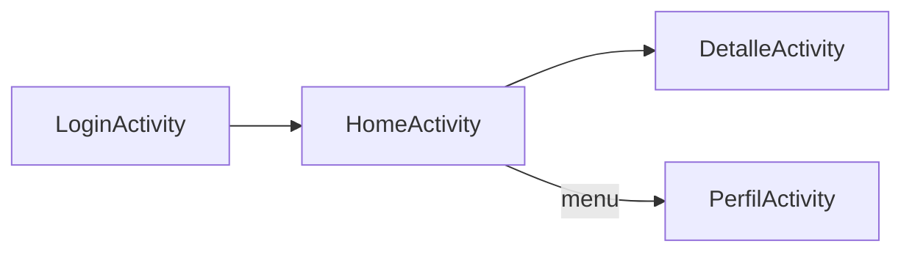

# AppViajero 🌍✈️

  

Aplicación **Android** para asistir a viajeros a **organizar sus viajes en una sola app** (intents implícitos/explicítos).  
**Equipo:** Faith Goldsberry ✨  
**Prototipo:** **AppViajero**

---

## 📦 Versión de Android / AGP
- compileSdk **36** · targetSdk **36** · minSdk **31**  
- AGP: no detectado (plugins DSL).  
- Probado en **Pixel 6 Pro (API 36)** (emulador).

> Si tu entorno usa otros valores, actualiza esta sección con lo que tengas en `app/build.gradle` y el `plugins` del proyecto.

---

## 🔐 Login simulado
Credenciales para pruebas:  
- Usuario: `viajero@viajes.cl`  
- Contraseña: `123456`  
Validaciones: email válido, password ≥ 6 chars; errores en campo con `setError()` y toasts básicos.

---

## 🧭 Mapa de navegación
**Launcher:** `LoginActivity` → `HomeActivity` → `DetalleActivity` / `PerfilActivity`



---

## 🧩 Intents implícitos (5)
1. **TripAdvisor (web)** — `ACTION_VIEW https://www.tripadvisor.com` 🌐  
2. **Compartir reseña por correo** — `ACTION_SENDTO mailto:` con `EXTRA_EMAIL`, `EXTRA_SUBJECT`, `EXTRA_TEXT` ✉️  
3. **Mapa con fallback** — `ACTION_VIEW geo:lat,lng?q=texto` (intent a Maps, fallback a navegador) 🗺️  
4. **Llamar taxi (marcador)** — `ACTION_DIAL tel:+56912345678` ☎️  
5. **Ajustes Wi‑Fi** — `Settings.ACTION_WIFI_SETTINGS` ⚙️  

**Flujos con captura:**  
- _Home → “Abrir mapa” → Google Maps_ (fallback a navegador si Maps no está).  
- _Home → “Enviar correo” → cliente de correo con asunto + cuerpo prellenados_.

---

## 🔁 Intents explícitos (3)
1. **Home → DetalleActivity (Itinerario)** — extras: `step_title`, `step_time`, `step_location`, `step_instructions`.  
2. **Home → PerfilActivity (menú)** — retorno con **Activity Result API** para saludar por nombre.  
3. **Animaciones personalizadas** — `overridePendingTransition` al cerrar `DetalleActivity`.

---

## 🧑‍💻 Código clave
**A. Email implícito**
```java
Intent email = new Intent(Intent.ACTION_SENDTO);
email.setData(Uri.parse("mailto:"));
email.putExtra(Intent.EXTRA_EMAIL, new String[]reviews@travelapp.com);
email.putExtra(Intent.EXTRA_SUBJECT, "Opinión sobre mi experiencia de viaje");
email.putExtra(Intent.EXTRA_TEXT, cuerpo);
startActivity(Intent.createChooser(email, "Enviar correo con:"));
```

**B. Mapa con fallback**
```java
Uri mapUri = Uri.parse("geo:-33.447487,-70.673676?q=Universidad Santo Tomás");
Intent mapIntent = new Intent(Intent.ACTION_VIEW, mapUri);
mapIntent.setPackage("com.google.android.apps.maps");
if (mapIntent.resolveActivity(getPackageManager()) != null) {
    startActivity(mapIntent);
} else {
    String url = "https://www.google.com/maps/search/?api=1&query=-33.447487,-70.673676";
    startActivity(new Intent(Intent.ACTION_VIEW, Uri.parse(url)));
}
```

**C. Explícito: abrir DetalleActivity con extras**
```java
Intent intent = new Intent(HomeActivity.this, DetalleActivity.class);
intent.putExtra("step_title", "City Tour");
intent.putExtra("step_time", "9:00 AM");
intent.putExtra("step_location", "Plaza de Armas");
intent.putExtra("step_instructions", "Reúnete en el punto de encuentro con tu guía.");
startActivity(intent);
```

---

## 🖼️ Capturas


> Incluye estas imágenes en tu commit en `docs/screenshots/` para que GitHub las renderice en el README.

---

## ▶️ Cómo compilar / APK
- **Debug APK**: `app/build/outputs/apk/debug/app-debug.apk` (Android Studio → _Build > Build Bundle(s)/APK(s) > Build APK(s)_)  
- Sube el APK al repositorio (o adjúntalo en una _Release_).  
- Si quieres, también puedes enviarme el APK y lo añado en `releases/` dentro del repo.

---

## ⬆️ Subir a GitHub
**Terminal**
```bash
git init
git add .
git commit -m "🚀 AppViajero MVP: intents y navegación"
git branch -M main
git remote add origin <URL-DEL-REPO>
git push -u origin main
```
**Web**
1. Crea repo `AppViajero` (sin README inicial).  
2. Arrastra archivos/carpeta `docs/screenshots/` y el `README_AppViajero.md`.  
3. Sube `app-debug.apk` o crea una **Release** y adjúntalo.

---

## ✅ Checklist de entrega
- [x] 5 intents **implícitos**  
- [x] 3 intents **explícitos**  
- [x] Validaciones de login básicas  
- [x] Capturas (≥ 4)  
- [x] README con versiones Android/AGP y emojis  
- [x] APK de debug o instrucciones para compilar

---

## 🗺️ Roadmap breve
Favoritos, tema dark, y shortcuts en `DetalleActivity` (Mapas, Llamar, Email).
